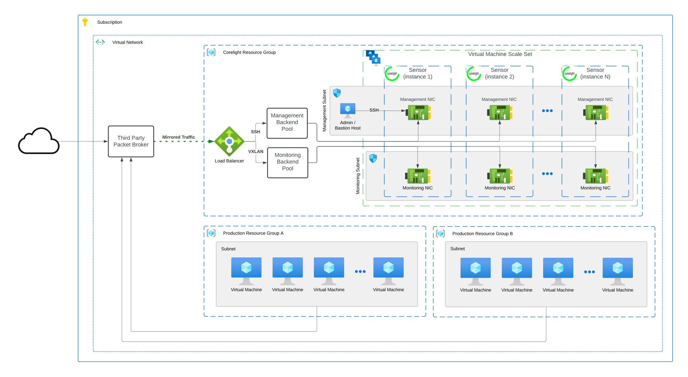

# terraform-azure-sensor

Terraform for Corelight's Azure Cloud Sensor Deployment.



## Usage
```hcl
resource "sensor" {
  source = "github.com/corelight/terraform-azure-sensor"

  license_key                    = "<your Corelight sensor license key>"
  location                       = "<Azure location to deploy resources in>"
  resource_group_name            = "<resource group to deploy in>"
  virtual_network_name           = "<virtual network where VMSS subnet should be deployed>"
  virtual_network_resource_group = "<virtual network resource group>"
  virtual_network_address_space  = "<virtual network address space (CIDR) used to create subnet>"
  corelight_sensor_image_id      = "<image resource id from Corelight>"
  sensor_api_password            = "<password for the sensor api>"
  sensor_ssh_public_key          = "<path to ssh public key>"

  # (Optional) Cloud Enrichment Variables
  enrichment_storage_account_name   = "<name of the enrichment storage account>"
  enrichment_storage_container_name = "<name of the enrichment container in the storage account>"
  tags                              = {
    foo: bar,
    terraform: true,
    purpose: Corelight
  }
}
```

### Deployment

The variables for this module all have default values that can be overwritten
to meet your naming and compliance standards.

Deployment examples can be found [here](examples).

## License

The project is licensed under the [MIT][] license.

[MIT]: LICENSE
